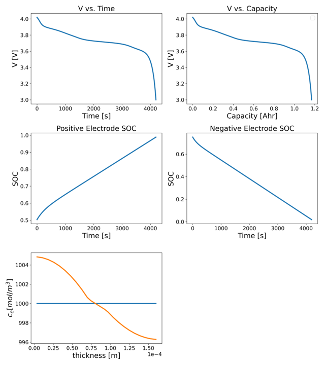
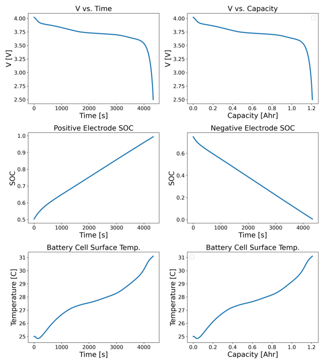
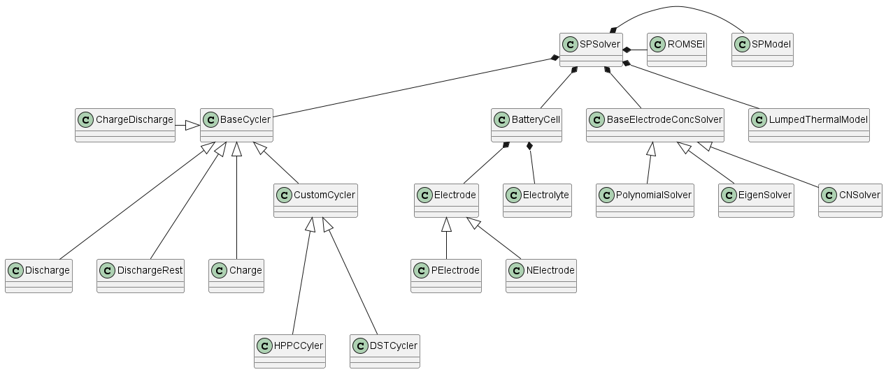

Shield: [![CC BY 4.0][cc-by-shield]][cc-by]

This work is licensed under a
[Creative Commons Attribution 4.0 International License][cc-by].

[![CC BY 4.0][cc-by-image]][cc-by]

[cc-by]: https://creativecommons.org/licenses/by-nc/4.0/
[cc-by-image]: https://i.creativecommons.org/l/by/4.0/88x31.png
[cc-by-shield]: https://img.shields.io/badge/License-CC%20BY%204.0-lightgrey.svg

# SPPy
#### SPPy © 2023 by Moin Ahmed is licensed under Attribution-NonCommercial 4.0 International. To view a copy of this license, visit http://creativecommons.org/licenses/by-nc/4.0

#### Created by Moin Ahmed (moinahmed100@gmail.com)

## Description

<p>
This repository contains the code for running equivalent circuit model (ECM), single particle model (SPM), 
single particle model with electrolyte dynamics (eSPM) with thermal and degradation models on Lithium-ion Batteries (LIB). Moreover, the repository contains the tools for 
visualization, model parameter estimations (e.g., using genetic algorithm), and Kalman filters (using Sigma Point Kalman 
Filter).
</p>
<p>
All the code is written in Python programming language, and it is written in a modular fashion. The code is
still an ongoing work and the documentation is not yet complete.
</p>
The [documentation](https://libsim.readthedocs.io/en/latest/) is available and currently hosted on readthedocs.io.

## Features

- <b>Single Particle Model with electrolyte dynamics, Single Particle Model (SPM) and Equivalent circuit model with 
 thermal (lumped thermal) and degradation (reduced-order SEI) models

- Parameter estimation using genetic algorithm

- Visualization tools
- Sigma Point Kalman Filter (for analyzing application' battery management system (BMS)) </b>

## Dependencies
- Python 3.10 and above
- numpy
- pandas
- matplotlib
- scipy
- tqdm
- pytests

## Installation

Either of the two recommended installation procedures can be used and the steps for these 
installation procedures are listed below.

### Git Clone

1. Install external python package dependencies required for this repository. Use the following code
   ```angular2html
        pip install -r requirements.txt
    ```

2. Clone the repository, for example using git clone git@github.com:m0in92/EV_sim.git using Git Bash.

### Python setup and tests
1. Download or clone this repository 
2. Ensure you are on the repository directory (where the setup.py resides) and run python setup.py sdist on the command line.
3. Step 2 will create a dist directory in the repository. Extract the contents tar.gz file in this directory. Move to 
the directory where the extracted files reside and run pip install EV_sim on the command line. This will install EV_sim
on your system (along with the external dependencies) and EV_sim can be imported as any other Python package.
4. The unittests on the repository can be performed by running the code below on the command line at the root project
directory.
    ```angular2html
    pytests tests
    ```

## Usage

Example usage are included in the SPPy/examples folder.

## Directory Structure:

```parameter_sets``` - the datasets containing the parameters for the simulations.

```Assests``` - the images used in the documentations.

```SPPy``` - the source code. Some of the subdirectories include:
- ```examples``` - the example usage under various simulation conditions.
- ```battery_components``` - classes for reading and storing battery cell component (e.g., electrode, electrolyte) parameters 
- ```models``` - classes with methods pertaining to battery, thermal, and degradation models
- ```solvers``` - numerical and simulation solvers
- ```visualization``` - visualization related classes

```tests``` - test files for this repository


## Solution Schemes

### Single Particle Model with Electrolyte Dynamics:
#### _Diffusion Equation Formulation:_
- Crank-Nicolson Method
- Eigen Function Expansion [1]
- Two Term Polynomial [2]
#### _Electrolyte Concentration Formulation:_
- Finite Volume Method (FVM)
#### _Numerical Schemes:_
- ODE solvers (rk4)

### Single Particle Model:
#### _Diffusion Equation Formulation:_
- Crank-Nicolson Method
- Eigen Function Expansion [1]
- Two Term Polynomial [2]
#### _Numerical Schemes:_
- ODE solvers (rk4)

### Equivalent Circuit Model (Thevenin and Enhanced Self-Correcting (ESC))
##### _Solution Schemes:_
- Discrete Time Solver
- Discrete Time Solver with Sigma Point Kalman Filter

### Thermal Models:
- Lumped Thermal Model
#### _Numerical Schemes:_
- ODE solvers (rk4)
### Degradation Models:
- ROM - SEI growth [3]
#### _Numerical Schemes:_
- ODE solvers (Euler)

### Sample Outputs

#### Single Particle Model with Electrolyte Dynamics


#### Single Particle Model - non isothermal


### Class Diagrams
#### Single Particle Model - Conceptual



### References:
1. Guo, M., Sikha, G., & White, R. E. (2011). Single-Particle Model for a Lithium-Ion Cell: Thermal Behavior. Journal of The Electrochemical Society, 158(2), A122. https://doi.org/10.1149/1.3521314/XML
2. Torchio, M., Magni, L., Gopaluni, R. B., Braatz, R. D., & Raimondo, D. M. (2016).
    LIONSIMBA: A Matlab Framework Based on a Finite Volume Model Suitable for Li-Ion Battery Design, Simulation,
    and Control.
    Journal of The Electrochemical Society, 163(7), A1192–A1205.
    https://doi.org/10.1149/2.0291607JES/XML
3. Randall, A. v., Perkins, R. D., Zhang, X., & Plett, G. L. (2012). Controls oriented reduced order modeling of solid-electrolyte interphase layer growth. Journal of Power Sources, 209, 282–288. https://doi.org/10.1016/J.JPOWSOUR.2012.02.114
